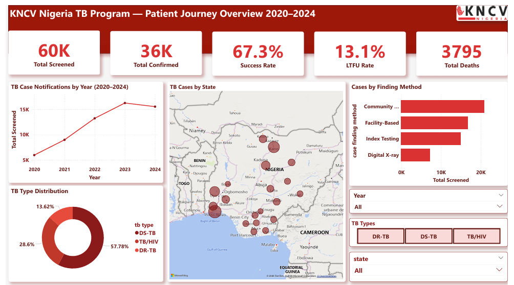
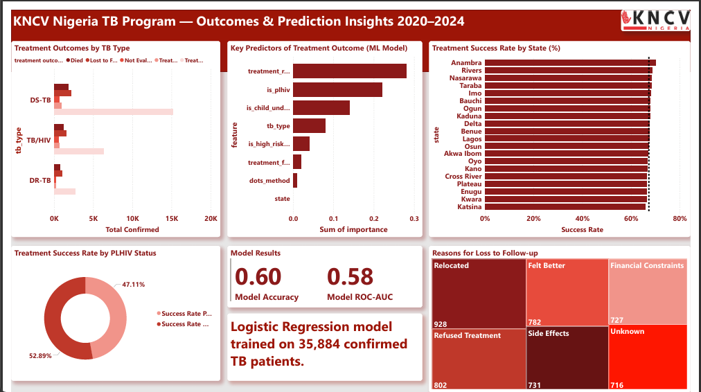

# KNCV Nigeria TB Analysis

End-to-end TB data analysis project examining the patient journey across KNCV Nigeria's program states — from screening to treatment outcome. Includes data generation, cleaning, exploratory data analysis, statistical testing, predictive modeling, and a Power BI dashboard.

## Project Overview
**Analysis Question:** From screening to success — tracking the TB patient journey across KNCV Nigeria's program states, and understanding what predicts treatment outcome.

**Data:** Synthetic dataset of 60,000 TB patient records (2020–2024) modeled on real Nigerian TB burden data and KNCV Nigeria's program structure.

## Repository Structure
```
kncv-nigeria-tb-analysis/
├── data/
│   ├── raw/
│   │   └── kncv_nigeria_tb_data_raw.csv
│   └── processed/
│       ├── kncv_nigeria_tb_data_cleaned.csv
│       └── feature_importance.csv
├── notebooks/
│   ├── 01_kncv_tb_cleaning_analysis.ipynb
│   ├── 02_kncv_tb_eda.ipynb
│   ├── 03_kncv_tb_statistical_analysis.ipynb
│   └── 04_kncv_tb_prediction.ipynb
├── scripts/
│   └── generate_kncv_tb_data.py
└── images/
    ├── page1.png
    └── page2.png
```

## Key Findings
- Lagos, Kano and Oyo account for the highest TB burden among KNCV program states
- TB case notifications dropped in 2020 due to COVID-19 disruption and recovered by 2023
- DR-TB patients have significantly worse treatment outcomes than DS-TB patients
- PLHIV have lower treatment success rates (47.11%) compared to HIV-negative patients
- Relocation is the leading reason for loss to follow-up
- No state met the WHO 90% treatment success rate target

## Prediction Model
Logistic Regression model trained on 35,884 confirmed TB patients to predict treatment success.
- **Accuracy:** 59.5%
- **ROC-AUC:** 0.58
- **Top predictors:** Treatment regimen, PLHIV status, child under 15

## Dashboard
Built in Power BI with 2 pages:
- **Page 1:** Patient Journey Overview — KPIs, case notifications trend, case finding methods, TB type distribution, geographic map
- **Page 2:** Outcomes & Prediction Insights — Treatment outcomes by TB type, success rate by state, PLHIV impact, LTFU reasons, ML model feature importance and performance

## Dashboard Preview



## Tools Used
- Python (pandas, numpy, matplotlib, seaborn, scikit-learn)
- Power BI
- Power Query
- Git/GitHub

*Synthetic dataset generated for portfolio purposes. Modeled on real program structure and Nigerian TB burden data.*
